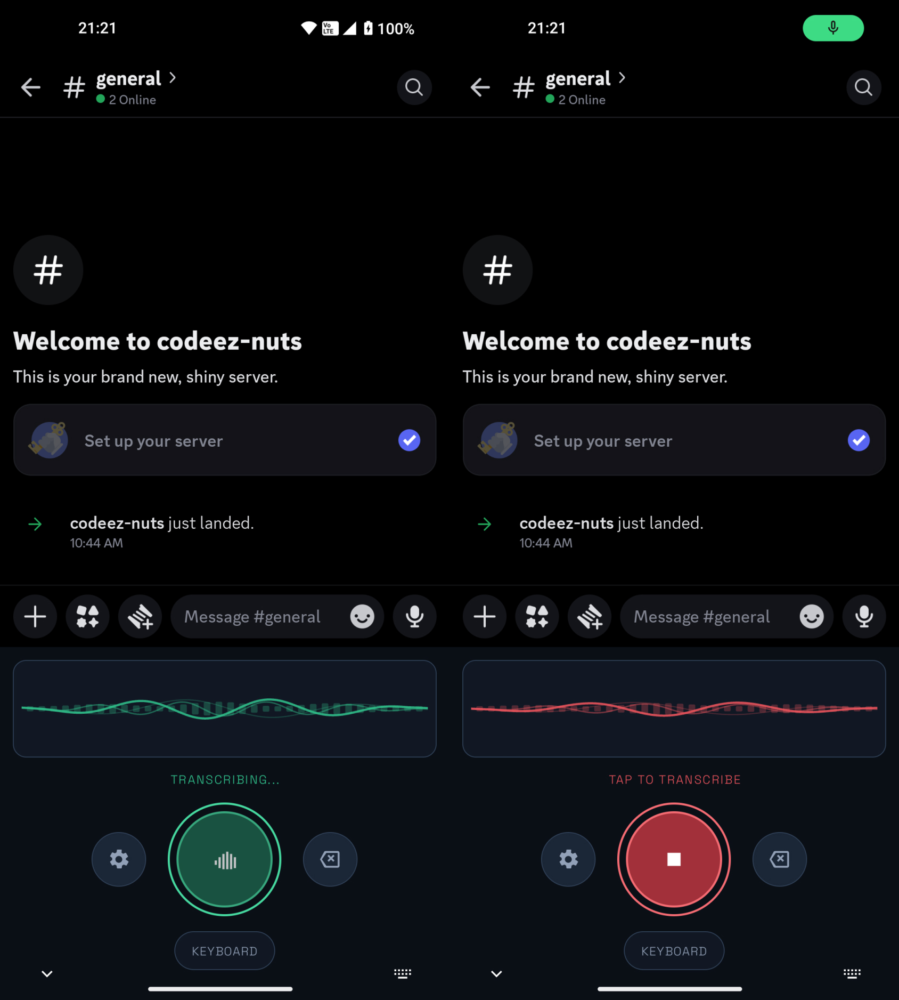

# Walkie Talkie Keyboard

Android dictation IME scaffold that uses the OpenAI Whisper API for transcription.

## What is implemented
- Native Kotlin IME service with hold-to-talk flow.
- In-memory PCM capture (`AudioRecord` @ 16k mono PCM16).
- Replaceable interfaces for model manager, capture, and ASR.
- Settings activity for permissions, IME settings, and API status.
- Unit test coverage for dictation state flow and commit behavior.

## Screenshot
Screenshots of the keyboard UI:

## Important setup notes
1. Provide an OpenAI API key for builds via environment variables:
   - `OPENAI_API_KEY` (required)
   - `OPENAI_BASE_URL` (optional, defaults to `https://api.openai.com/v1`)
2. Local setup (repo-specific, recommended):
   - Add the key to `local.properties` in the repo root (this file is gitignored):
   - `OPENAI_API_KEY=...`
   - `OPENAI_BASE_URL=https://api.openai.com/v1` (optional)
3. Optional environment variable override:
   - `export OPENAI_API_KEY=...` (and optionally `export OPENAI_BASE_URL=...`) in your shell.
4. Optional Gradle property fallback:
   - Copy `gradle.properties.example` to `~/.gradle/gradle.properties` and fill in `OPENAI_API_KEY`.
   - Or pass `-POPENAI_API_KEY=...` when invoking Gradle.

## Main paths
- `app/src/main/java/com/walkietalkie/dictationime/ime/DictationImeService.kt`
- `app/src/main/java/com/walkietalkie/dictationime/ime/DictationController.kt`
- `app/src/main/java/com/walkietalkie/dictationime/asr/WhisperApiRecognizer.kt`
- `docs/architecture.md`
